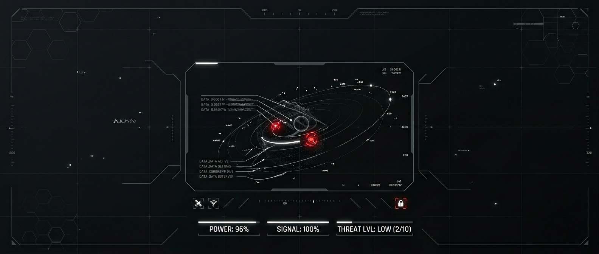

  
  
    

  <h2>F R E D D Y &nbsp; M A T T H E W</h2>
  
<b>CSE • CLOUD COMPUTING • DATA ANALYTICS • FULL-STACK ENGINEERING</b>

  
   

  

    Computer Science & Engineering student focused on building scalable cloud architectures and data-driven solutions. 
    I build projects involving robust backend systems, relational database management, and full-stack development. 
    Currently exploring advanced Python analytics, cloud infrastructure, and modern web frameworks.
  

 

---

### ✧ CURRENTLY_WORKING_ON

* 🔹 **Cloud Infrastructure & Data Pipelines:** Engineering cloud-native applications and structuring reliable data workflows.
* 🔹 **Cifix (Crowdsourced Civic Issue System):** Developing a full-stack platform with real-time updates utilizing React, Node.js, and MongoDB.
* 🔹 **Advanced Data Visualization:** Building containerized data analytics dashboards to process and visualize large-scale datasets.
* 🔹 **Backend Performance:** Leveraging core Python, C, and Java for high-performance software development and algorithm efficiency.
* 🔹 **Competitive Engineering:** Building on high-level problem-solving success from events like the Smart India Hackathon.

 

---

### ✧ TECH_STACK

  
  
  
  
  
   
  
  
  
   
  
  
  
   
  
  
  

 

---

### ✧ FEATURED_PROJECTS

**🔹 Cifix - Crowdsourced Civic Issue Reporting System**
> A web and mobile platform for citizens to report civic issues like potholes and garbage. Features real-time updates, photo uploads, issue tracking, and a centralized dashboard for authorities. Built with React, Node.js, and MongoDB.

**🔹 Cloud-Deployed Data Analytics Dashboard**
> An interactive, containerized web dashboard designed to process and visualize large-scale raw datasets. Features real-time metric tracking deployed via Docker on cloud infrastructure. Built with Python and modern cloud services.

**🔹 Logic & Algorithm Architecture Suite**
> Engineered a high-performance suite focusing on algorithm efficiency and modular design. Built utilizing clean code architecture to handle complex logic execution and strategy optimizations with minimal latency. Built with Python and C++.

 

---

### ✧ GITHUB_STATS

  

 

---

### ✧ CONTRIBUTION_GRAPH

 

---

### ✧ CONNECT_WITH_ME

  
  

